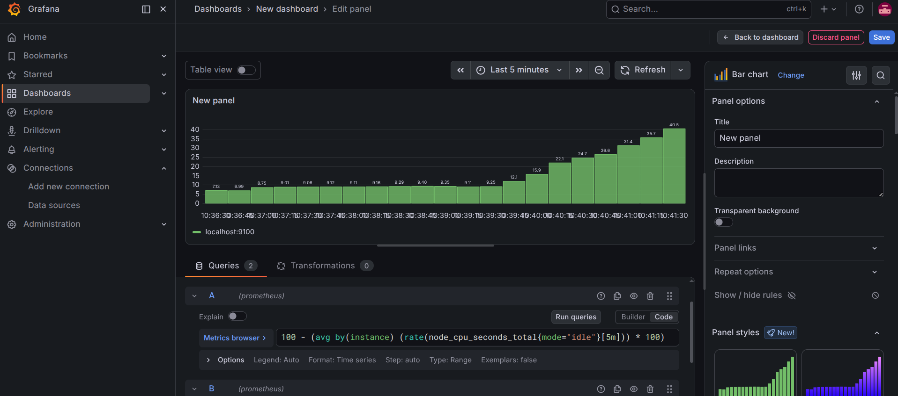
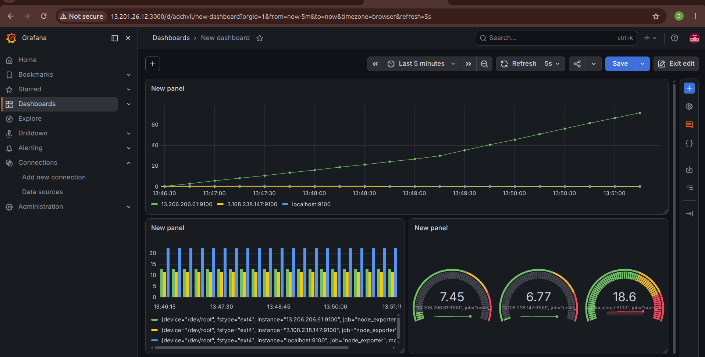
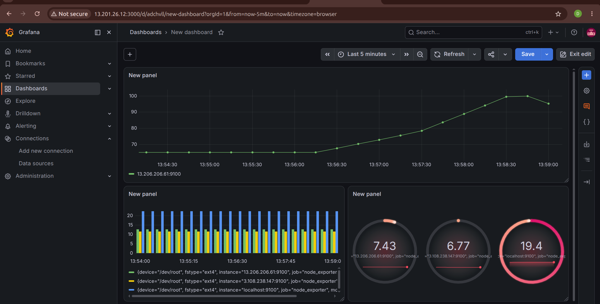
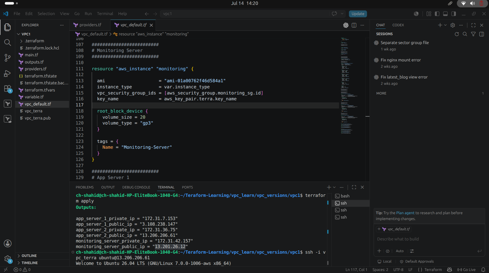

# aws_monitoring

markdown
# AWS Infrastructure Monitoring using Terraform, Ansible, Prometheus & Grafana

## Dashboard Preview

### CPU Utilization Dashboard

Real-time CPU utilization monitoring of AWS EC2 instances using Prometheus and Grafana.

---

### Infrastructure Monitoring Dashboard

Displays live infrastructure metrics collected from all monitored EC2 instances.

---

### Performance Dashboard

Shows real-time server performance metrics including CPU, Memory, Disk, and Network usage.

---

### AWS Infrastructure

Three AWS EC2 instances were deployed:

- Monitoring Server
- App Server 1
- App Server 2

---

### Terraform Infrastructure Code

Terraform was used to provision the complete AWS infrastructure automatically.

---

# Project Description

This project demonstrates how to build an automated monitoring solution on AWS using **Terraform**, **Ansible**, **Prometheus**, **Grafana**, and **Node Exporter**.

Terraform provisions the AWS infrastructure, while Ansible automates the installation and configuration of the monitoring stack. Prometheus collects metrics from all EC2 instances, and Grafana provides real-time dashboards for infrastructure monitoring.

---
monitoring-project/
│── ansible.cfg
│── inventory.ini
│── playbook.yml
└── roles/
    ├── node_exporter/
    │   └── tasks/
    │       └── main.yml
    ├── prometheus/
    │   └── tasks/
    │       └── main.yml
    └── grafana/
        └── tasks/
            └── main.yml

# Infrastructure

The environment consists of three AWS EC2 instances.

### Monitoring Server

- Prometheus
- Grafana
- Node Exporter

### App Server 1

- Node Exporter

### App Server 2

- Node Exporter

---

# Technologies Used

- AWS EC2
- Terraform
- Ansible
- Prometheus
- Grafana
- Node Exporter
- Ubuntu Linux

---

# Features

- Infrastructure Provisioning using Terraform
- Automated Configuration using Ansible
- Monitoring of Multiple EC2 Instances
- CPU Utilization Dashboard
- Memory Monitoring
- Disk Usage Monitoring
- Network Monitoring
- Real-time Metrics Collection
- Infrastructure Automation

---

# Monitoring Stack

The Monitoring Server collects metrics from all EC2 instances through Node Exporter.

Prometheus continuously scrapes metrics from every server and stores them in its time-series database.

Grafana connects to Prometheus as a data source and visualizes the collected metrics through interactive dashboards.

---

# Alerting

SMTP email notifications were configured to send alerts whenever CPU utilization exceeded the configured threshold. This enables proactive monitoring and faster response to high resource usage.

---

# Learning Outcomes

This project helped me gain practical experience in:

- Infrastructure as Code (Terraform)
- Configuration Management (Ansible)
- AWS Infrastructure Deployment
- Linux Server Administration
- Prometheus Monitoring
- Grafana Dashboard Creation
- Infrastructure Automation
- Monitoring Best Practices

---

# Author

**Muhammad Shahid**
Devops Engineer
